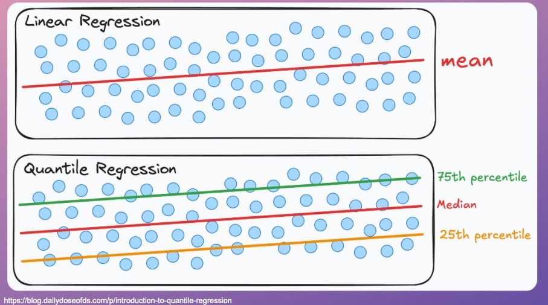
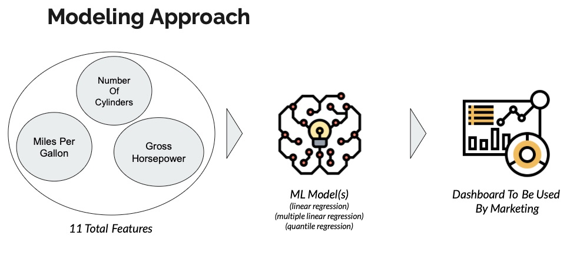
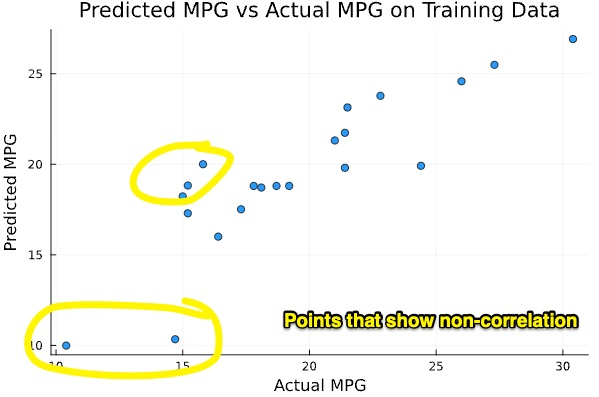
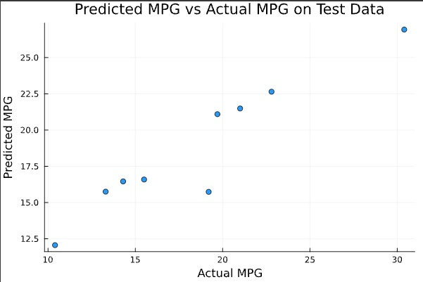
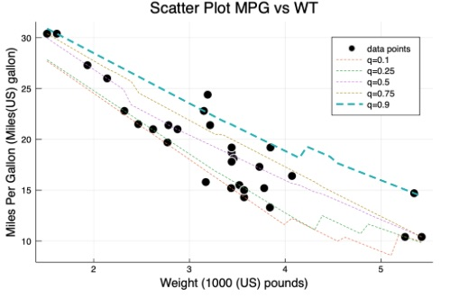

# Regression Analysis Car MPG Project: Linear and Quantile Regressions in Julia Programming

<div align="center">
    
</div>

<br>

## Project Description

#### Problem

Jim's New York City used car lot's marketing department wants to predict thatthe miles per gallon (msg) for future inventory vehicles in order to target potential car buyers based on vehicle's miles per gallon and specific car details.

#### Why it needs to be addressed

Sales for the lot are lower than national and local averages. The return on the investment (ROI) in a non-mpg focused marketing strategies have so far been costing the business $1MM per year.

#### Proposed Solution

Leverage machine learning models with cross validation to formulate a predictive model or models to predict automobile miles per gallon. The marketing team can then use these results to catagorize and inform their marketing campaigns to target specific kinds of customers and to determine what cars they should be purhcasing to bolster their inventory.

#### Modeling Approach

<div align="center">
    
</div>

<br>

#### Solution Performance

An initial single feature linear regression model relying on automobile weight solely as the key independent feature predicting MPG:

$y(mpg) = intercept + Constant \cdot weight$

$mpg = 32.95 - 4.33 \cdot weight$

yielded fair results, but visual inspection of correlations between predicted values vs actual mpg values on test data showed that better performance required multiple features in our regression model

<div align="center">
    
</div>

After trying regressions with multiple features via trial and error, a multiple feature regression model using weight and cyclinders revealed better peformance as the correlation results revealed.

$y(mpg) = intercept + Constant_{weight} \cdot Weight + Constant_{cyl} \cdot Cyl$

$mpg = 35.98 - 2.62 \cdot Weight - 1.27 \cdot cycl$

<div align="center">
    
</div>

Next, a quantile regression prediction model was developed. Here, quantile regression is a regression method for estimating conditional quantile functions. Just as linear regression estimates the conditional mean function as a linear combination of the predictors, quantile regression estimates the conditional quantile function as a linear combination of the predictors. With this technique we are able to see what is happening in a localized area of a distribution. Namely, we can see which part of the MPG distribution is affected by a specific feature.

For example, looking at the weight feature solely and perform a quantifed regression, the 0.10 quantile refers to the lower MPG group. For one one more unit of weight, it can be observed that this 0.10 group reduces MPG by -6.49.

The 0.90 quantile refers to the higher MPG group. For one more unit of weight, it can be observed that this 0.90 group reduces the MPG by -4.10.

In short, quantile regression tell us that the Negative effect (i.e., reducing MPG) effect of weight on MPG is worse for vehicles with low MPGs already.

<div align="center">
    
</div>


## Tech Stack


[]


## Getting Started

You will need to install Julia and IJulia to utilize the Jupyter notebooks in this repository. Then, clone the repository and you are ready to go.

## Installation Steps

### Install Julia

You will need at least Julia version 0.6.2 or higher.

1. **juliaup**

A recommended way to install Julia is to install [juliaup](https://github.com/JuliaLang/juliaup) which is a small, self-contained binary that will automatically install the latest stable Julia binary and help keep it up to date. It also supports installing and using different versions of Julia simultaneously.

Install `juliaup` by running this in your terminal:

```
curl -fsSL https://install.julialang.org | sh

```

This will install the latest stable version of Julia, which can be launched from a command-line by typing `julia` as well as the `juliaup` tool. To install different Julia versions see `juliaup --help`.

2. **Downloads**
   If you want to manually download and install specific Julia versions, see the [Downloads](https://julialang.org/downloads/) page.

### Install IJulia to Use Jupyter Notebooks

Install `IJulia` using instructions [here](https://github.com/JuliaLang/IJulia.jl)

### Data Sources

The data was obtaind from the `R` programming language's Motor Trend Car Road Tests (`mtcars`) dataset with 11 numeric car details (features/variables): 
* miles(US) per gallon (msg), 
* number of cylinders,
* displacment,
* gross horsepower,
* rear axle ratio,
* weight (1000 lbs),
* 1/4 mile time,
* engine (0=V-shaped, 1=straight),
* transmission (0=automatic, 1=manual),
* number of forward gears, and 
* number of carburetors.

## Final Words

Thanks for visiting.

Give the project a star (⭐) if you liked it or if it was instructional for you!

You've `beenlanced`! 😉

## Acknowledgements

I would like to extend my gratitude to all the individuals and organizations who helped in the development and success of this project. Your support, whether through contributions, inspiration, or encouragement, have been invaluable. Thank you.

Specifically, I would like to acknowledge:

- The folks at [Julialang.org](https://julialang.org/) for their installation instructions and up-to-date information on the happenings with Julia.

- [Hema Kalyan Murapaka](https://www.linkedin.com/in/hemakalyan) and [Benito Martin](https://martindatasol.com/blog) for sharing their README.md templates upon which I have derieved my README.md.

## License

This project is licensed under the MIT License - see the [LICENSE](./LICENSE) file for details
